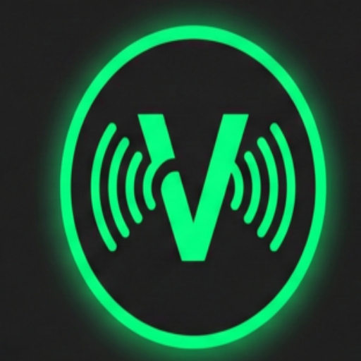

# 🎵 VibeDownloader - Professional Audio Studio


> **A plataforma definitiva para DJs e Audiófilos.** Baixe, analise e edite metadados de áudio em alta fidelidade.

---

## 🚀 Sobre o Projeto

O **VibeDownloader** não é apenas um downloader de vídeos/áudio; é uma **ferramenta de engenharia de áudio** completa projetada para profissionais que exigem qualidade. O sistema resolve o maior problema dos DJs modernos: a incerteza sobre a qualidade real dos arquivos baixados da internet (falsos 320kbps/FLAC).

Este projeto integra downloads de múltiplas fontes com **análise espectral em tempo real**, garantindo que o usuário visualize cortes de frequência (shelf) antes de utilizar a faixa em um sistema de som profissional.

---

## 📸 Screenshots

<div align="center">
  
</div>

---

## 🛠️ Stack Tecnológico & Habilidades Demonstradas

Este projeto demonstra competências avançadas em **Desenvolvimento Full Stack** e **Processamento Digital de Sinais (DSP)**.

### 🖥️ Backend (Python & Flask)
* **Arquitetura MVC:** Estrutura robusta utilizando **Flask Blueprints** e padrões de design limpo.
* **Segurança:** Implementação de **Flask-Login** para autenticação de sessões, hashing de senhas com `Werkzeug` e proteção contra CSRF.
* **Banco de Dados:** Modelagem Relacional com **SQLAlchemy (SQLite)** para gestão de usuários, assinaturas, pagamentos e cupons.
* **Integração de Pagamentos:** API completa do **Mercado Pago** para processamento de assinaturas via PIX com Webhooks para aprovação automática em tempo real.

### 🎧 Engenharia de Áudio (DSP)
* **Core:** Manipulação de áudio via **FFmpeg** e **yt-dlp**.
* **Análise Espectral:** Uso de **Librosa** e **Matplotlib** (`Agg` backend) para gerar espectrogramas visuais precisos, permitindo auditoria de qualidade (lossless vs lossy).
* **Metadados (ID3):** Edição programática de tags (Capa, Artista, Álbum) utilizando a biblioteca **Mutagen**, garantindo compatibilidade com Rekordbox e Serato.

### 🎨 Frontend (UI/UX)
* **Design Responsivo:** Interface moderna "Dark Neon" criada com **CSS3 Grid/Flexbox** puro (sem frameworks pesados), otimizada para Mobile e Desktop.
* **Interatividade:** JavaScript Vanilla (ES6+) para manipulação dinâmica do DOM, feedback visual assíncrono (AJAX/Fetch API) e gerenciamento de estado da UI.

### ⚙️ DevOps & Infraestrutura
* **CI/CD:** Pipeline de Deploy automatizado via **GitHub Actions** (`deploy.yml`).
* **Serviços Linux:** Configuração de serviço **Systemd** para execução contínua e gerenciamento de processos com **Gunicorn**.
* **Monitoramento:** Logs de erro e tratamento de exceções robusto.

---

## ✨ Funcionalidades Principais

1.  **Downloads Multi-Formato:** Suporte nativo para MP3 (320kbps), WAV, FLAC e AIFF.
2.  **Verificação de Integridade (Spek):** Geração automática de gráfico de espectro para detecção de *transcoding* falso.
3.  **Editor de Tags Automático:** Aplica capa, artista e título automaticamente ou permite edição manual antes do download final.
4.  **Sistema de Assinatura:** Controle de acesso VIP com expiração automática e renovação via PIX.
5.  **Cupons & Referrals:** Sistema de marketing integrado com códigos promocionais e lógica de uso único/global.

---

## 🔧 Como Executar Localmente

Siga os passos abaixo para rodar o projeto em seu ambiente de desenvolvimento:

### Pré-requisitos
* Python 3.8+
* FFmpeg instalado e adicionado ao PATH do sistema.

### Instalação

1.  **Clone o repositório**
    ```bash
    git clone [https://github.com/denilsude/vibedownloader.git](https://github.com/denilsude/vibedownloader.git)
    cd vibedownloader
    ```

2.  **Crie e ative o ambiente virtual**
    ```bash
    python -m venv venv
    # Windows
    venv\Scripts\activate
    # Linux/Mac
    source venv/bin/activate
    ```

3.  **Instale as dependências**
    ```bash
    pip install -r requirements.txt
    ```

4.  **Configure as Variáveis de Ambiente**
    Renomeie o arquivo `.env.example` para `.env` e configure suas chaves:
    ```ini
    FLASK_SECRET_KEY=sua_chave_super_secreta
    MERCADOPAGO_ACCESS_TOKEN=seu_token_mp
    ```

5.  **Execute o servidor**
    ```bash
    python app.py
    ```
    O projeto estará rodando em `http://localhost:5002`

---

## 👨‍💻 Autor

**Denilson** *Full Stack Developer | Python Enthusiast | Audio Tech*

[](https://www.linkedin.com/in/seu-linkedin)
[](https://github.com/denilsude)

---

<p align="center">
  <i>Desenvolvido com ❤️ e muita música.</i>
</p>
